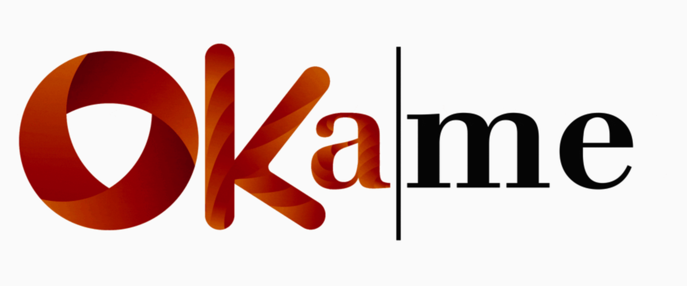

===================

- - - - 

# Introduction #
- - - - 
Présentation entreprise

# Concept #
- - - - 
Présentation du concept

# Quick Start #
- - - - 

Make sure you have Node version >= 6.X and NPM >= 3 (node.js version used 7.5.0 and NPM v. 4.1.2)

#### Clone the repo ####
$ git clone https://github.com/AndreasArnolfo/OKAME-APP.git

#### change directory to our repo ####
cd OKAME-APP
#### install the nodes-modules #### 
npm install
#### start ####
ionic serve or ionic lab

go to http://0.0.0.0:8100 or http://localhost:8100 in your browser

# License #

- - - - 

